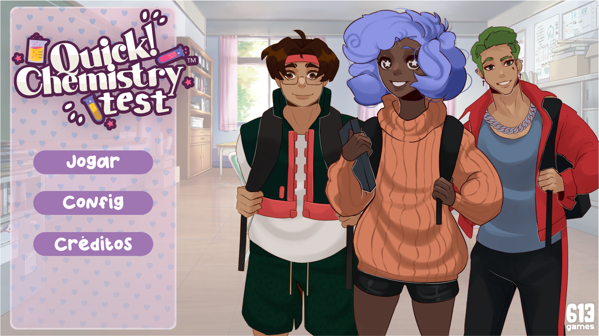

# Quick chemistry test

Quick chemestry test é uma visual novel desenvolvida por mim e meus colegas de esco.

## História

No jogo acompanhamos a história de Alba, que está muito ansiosa com o teste semestral de química. Ao longo do caminho para a escola o jogador responde perguntas feitas por Tony, melhor amigo de Alba, para testar os conhecimentos da protagonista. O boss final do jogo é professora Nilce e suas questões químicas.

## Créditos

### Direção

- Victor Rosário
- D'Sordes Moreira Alves

### Roteiro

- Keyla Oliveira
- Ludymilla Rangel
- Ademes Caldas
- Davi Lucas dos Santos

### Arte

- Victor Rosário

### Equipe de desenvolvimento

- D'Sordes Moreira Alves
- Lucas Oliveira
- Enzo Soares Crusoé
- Wilson Palma
- Jhaydson Bispo
- Júllia Iasmin Ribeiro da Rocha Pytta  
- Helenna Santana dos Santos  

### Equipe de tradução

- Kamily Seara Santos
- Lisler Rigaud

### Equipe de pesquisa

- Ludymilla Rangel
- Ademes Caldas
- Samuel Carqueija

### Turma

- Ademes dos Santos Caldas  
- Álvaro Fernando Costa de Brito  
- Amanda Coelho de Souza  
- Ana Luiza Vidal Teixeira  
- Davi Lucas dos Santos  
- D´Sordes Moreira Alves  
- Enzo Soares Crusoé Silva  
- Gabriel Reis de Assis  
- Gustavo Teixeira Andrade  
- Helenna Santana dos Santos  
- Henrique Natiel dos Santos Alves  
- Jhaydson Bispo Sousa  
- Joalbert Santos Leite  
- Júllia Iasmin Ribeiro da Rocha Pytta  
- Kamilly Seara Santos  
- Keyla Oliveira da Anunciação  
- Lisler Mota Rigaud  
- Lucas Oliveira Santos  
- Ludymilla Santos Rangel do Nascimento  
- Marcela Stefanny Silva Dias  
- Marlon Souza da Silva  
- Maxwell Moreno da Silva  
- Rafael Pereira dos Santos  
- Rebeca Costa Santos  
- Sabrina Ferreira do Nascimento da Cruz  
- Samuel Carqueija Santos  
- Victor Rosário dos Santos  
- Wilson Palma Souza